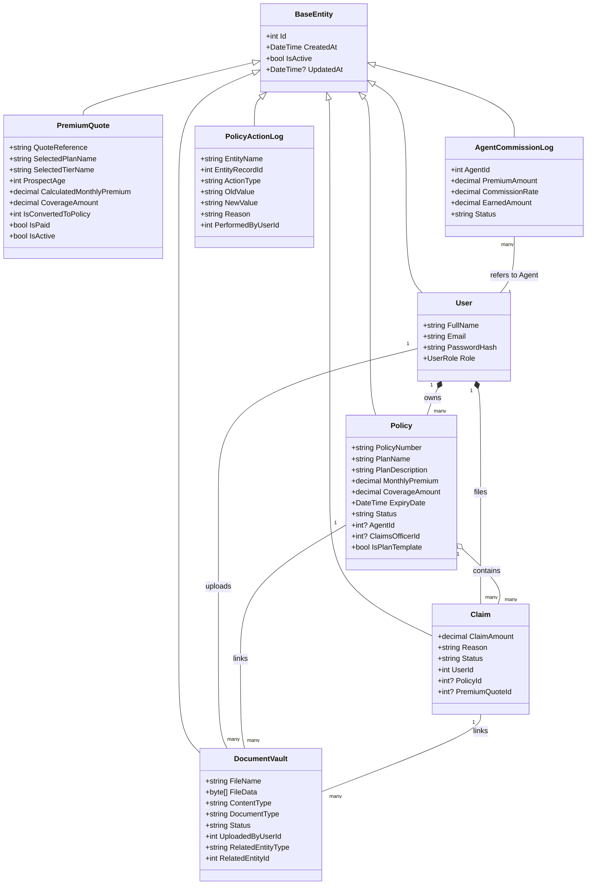

# NexusCare - Detailed Class Diagram Code

This diagram defines the domain entities, their specific variables, and the structural relationships within the Clean Architecture.

```mermaid
classDiagram
    class BaseEntity {
        +int Id
        +DateTime CreatedAt
        +bool IsActive
        +DateTime? UpdatedAt
    }

    class User {
        +string FullName
        +string Email
        +string PasswordHash
        +UserRole Role
    }

    class Policy {
        +string PolicyNumber
        +string PlanName
        +string PlanDescription
        +decimal MonthlyPremium
        +decimal CoverageAmount
        +DateTime ExpiryDate
        +string Status
        +int? AgentId
        +int? ClaimsOfficerId
        +bool IsPlanTemplate
    }

    class PremiumQuote {
        +string QuoteReference
        +string SelectedPlanName
        +string SelectedTierName
        +int ProspectAge
        +decimal CalculatedMonthlyPremium
        +decimal CoverageAmount
        +int IsConvertedToPolicy
        +bool IsPaid
        +bool IsActive
    }

    class Claim {
        +decimal ClaimAmount
        +string Reason
        +string Status
        +int UserId
        +int? PolicyId
        +int? PremiumQuoteId
    }

    class DocumentVault {
        +string FileName
        +byte[] FileData
        +string ContentType
        +string DocumentType
        +string Status
        +int UploadedByUserId
        +string RelatedEntityType
        +int RelatedEntityId
    }

    class AgentCommissionLog {
        +int AgentId
        +decimal PremiumAmount
        +decimal CommissionRate
        +decimal EarnedAmount
        +string Status
    }

    class PolicyActionLog {
        +string EntityName
        +int EntityRecordId
        +string ActionType
        +string OldValue
        +string NewValue
        +string Reason
        +int PerformedByUserId
    }

    BaseEntity <|-- User
    BaseEntity <|-- Policy
    BaseEntity <|-- PremiumQuote
    BaseEntity <|-- Claim
    BaseEntity <|-- DocumentVault
    BaseEntity <|-- AgentCommissionLog
    BaseEntity <|-- PolicyActionLog

    User "1" *-- "many" Policy : owns
    User "1" *-- "many" Claim : files
    Policy "1" o-- "many" Claim : contains
    User "1" -- "many" DocumentVault : uploads
    Policy "1" -- "many" DocumentVault : links
    Claim "1" -- "many" DocumentVault : links
    AgentCommissionLog "many" -- "1" User : refers to Agent
```
